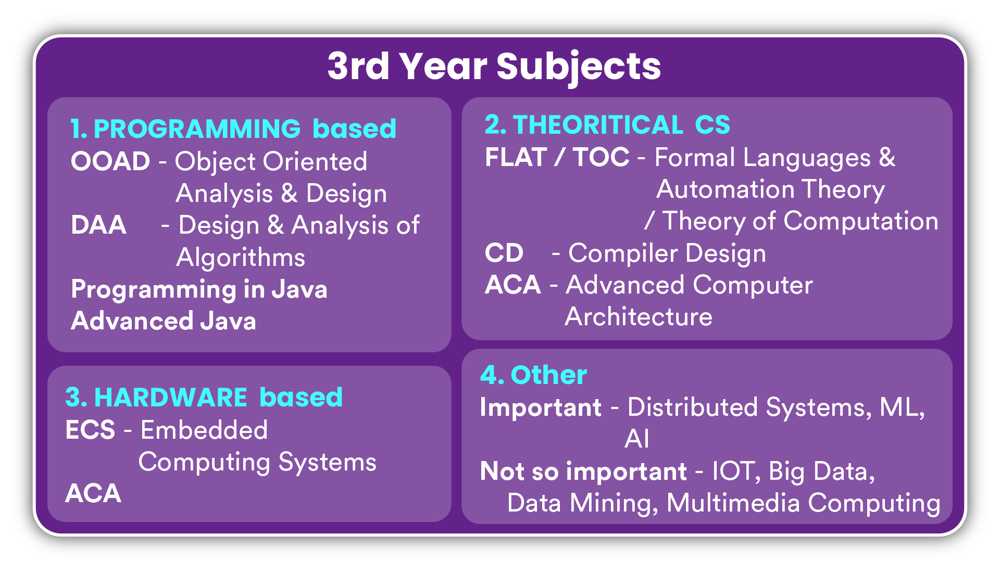
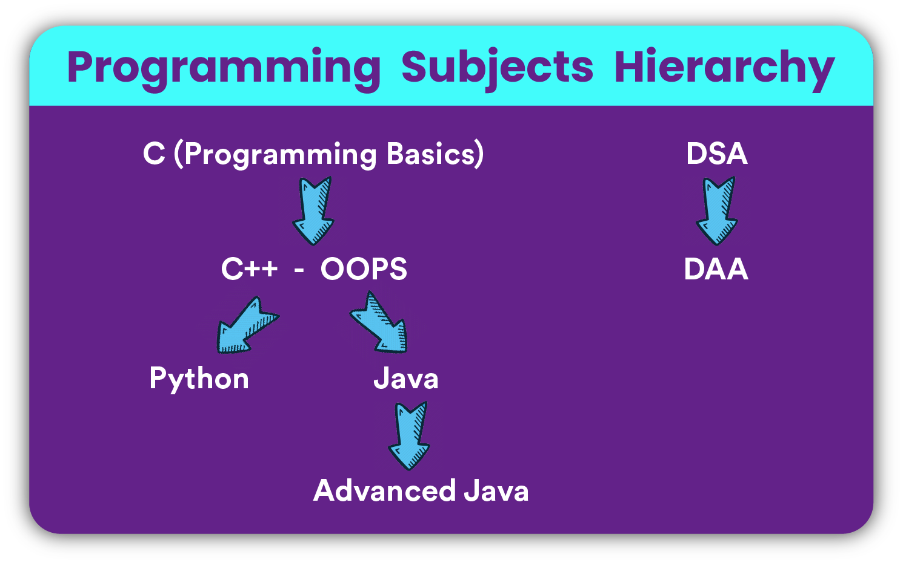
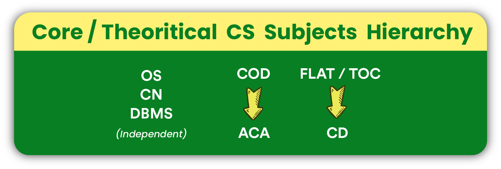
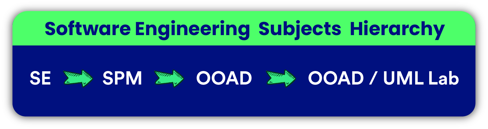
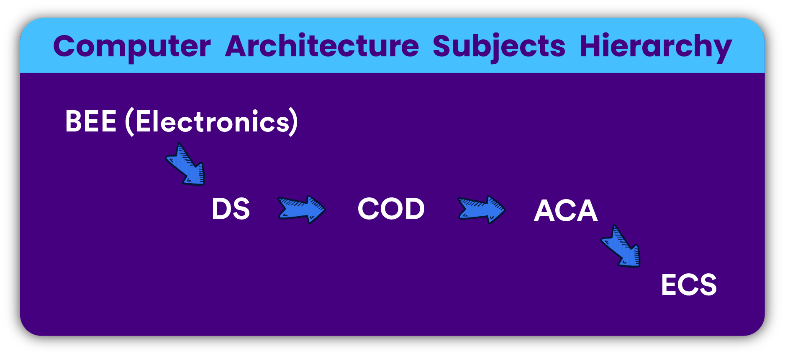

Namaskaram and welcome to the 3rd episode of the series CSE Simplified. The topic is - "B.Tech journey and Subject Hierarchy". We will discuss the subjects that matter the most, the way you should approach them and how to avoid some common mistakes. We will show the subject hierarchy and the links between different subjects which might help you take the right decisions.

We have a lot of advice to give. Just relax and watch till the end. You will definitely find this episode very useful.

Without further ado, let's get started!

_Following is the transcript of the episode. You may like to watch the video [here](https://youtu.be/kjRZ6dnclwA)_

---

# **1st Year**

1st year is common for all branches of B.Tech. You will have to study the basics of several interdisciplinary subjects like Electronics, Electrical, Mechanical engineering etc. This allows you to switch branches from 2nd year in case you took the wrong one. Having just 1 CSE subject i.e. programming doesn't mean that you are supposed to relax and chill.

Your 1st year is a golden opportunity to enhance your programming skills and learn the fundamentals.

### **Myths**

Before talking more about programming, let me bust out a few myths for you.

1. **Programs you write in college are enough** Many people think that the programs they write in college are enough. Well, those programs are taught to even school kids these days. You need to be a competitive programmer and a problem solver. If you are not taught programming well in college, then become self dependent. Learn online. We have listed out some free resources in the description below. Pick C++/Java (Why? Watch [this](https://www.youtube.com/watch?v=xvCh6v2KK9c) episode). Most probably you will have C/C++ only in your 1st year. Work on the language fundamentals first and then only move to DSA and competitive programming. In every semester you will encounter different languages and if you are good at C/C++ then definitely, you can get started with any other languages within 1 to 3 weeks.
2. **The "I already know" guy is above all** There are some students who have been already introduced to programming in school. Some are over confident that they need not learn anything and they already know CSE. Well, whatever most of them already learnt is just a drop as compared to the endless ocean of CSE. They are like "A frog in the well" 😀. Don't think that you won't be able to compete with such students. Believe in yourself and work continuously. Programming is something you must do regularly to be good at otherwise you will forget whatever you know. But such students do have an advantage among others. They need not learn the programming fundamentals again. Instead they should head over to the online platforms, learn DSA online or from a book and start practicing. 1st year is the best time to start work on your programming skills.

So by the end of your 1st year, you must have practiced 100+ basic programming problems.

### **Don't skip engineering mathematics**

Mathematics subjects like DM, LA, DE, Calculus etc. are at the very core of CSE. Teachers will never tell why you are studying all these subjects. It is your responsibility to surf the internet and get familiar with applications of such subjects.

### **Electronics is important**

The hardware story of computers starts from electronics. You will learn about Digital Gates.

### **1st vacation**

In the vacation that follows, dive deeper into DSA, solve more problems and participate in online contests.

---

# **2nd year**

2nd year is where CSE will actually begin. Among the 4 years of B.Tech, 2nd year is a bit special and important because you will face several significant subjects from the CSE perspective.

Having learnt C in 1st year, the college expects that you are very good at programming. Basics will not be repeated again. New concepts are there for you to digest. If you have not worked on your programming skills in 1st year, this is the year when you will start getting demotivated. So, better follow what we said earlier in this video for 1st year. Because if you are in tier 3 college, lectures will be boring, there will be no implementation based learning. You will never be able to learn programming or any other topic if you don't travel the extra mile. There is a whole culture of rote learning. Teacher will just narrate the notes. If you are among those who rote learn codes, Well start the countdown your bad days are about to come. If you don't take control of the situation. Don't expect anything from teachers or college. You are on your own in this journey.

So, beware of such things and better become independent. Follow standard textbooks and take help online. And here is a great lesson for you! Team up and learn together. You will never get anywhere if you are alone. Create a learning and motivated environment around you.

As this year is important, reduce your programming hours and start focusing on CSE subjects. I repeat, just reduce programming hours. Don't keep it aside. Keep practicing 1-5 problems daily.

Before we proceed with the subjects, let me be very clear that college syllabus isn't enough, refer books or online courses to really understand the subjects.

### **Subjects**

Okay so, We have classified the subjects taught in 2nd year as follows:

- **Programming based**

  - **DSA** - Do not take DSA as a theory subject rather write programs on your own and play around with data structures. For those aiming for product based companies only, journey till this subject is enough. Further, they just need to work on CP and they are done. But please understand this - If you learn CSE properly, then it has a lot more to offer.
  - **CG** - Computer Graphics (as I learnt it) focussed on understanding algorithms to draw a line, circle, ellipse etc. Other topics include Filling polygons, Clipping Algorithms, 2D 3D transformations etc. Write programs for these algorithms on your own.
  - **OOPS** - After structures in C, the story of OOPS starts with classes. Which opens up a whole new dimension for building real world applications. Learn these concepts very well. They will help you a lot in the long career ahead.
  - **Programming in Python**

- **Software Engineering**

  - **SE, SPM** - These subjects are relevant to those who have picked development by the start of 2nd year. Not of great significance but still no harm in paying a little attention.

- **Hardware based**

  - **DS** - The story of Basic Electronics Engineering subject is followed by Digital Systems. Here you will learn the basic building blocks of a CPU like adders. You will also learn Binary number system, Boolean Algebra, the need of Clocks and about several other circuits to strengthen your basic hardware knowledge of computers.
  - **COD** - The DE story is followed by COD. Here you will learn about number Binary number system, great algorithms to add, multiply and divide binary numbers, machine instructions, IO etc. Also you will know how several CPU components fit in and interact with each other. This solid foundation of computers is very important and you must learn it.

- **Theoretical CS**

  Following 3 subjects are also among the important subjects of CSE. Which you must learn by referring to standard textbooks or an online course.

  - **CN** - The Internet turned out to be a very big deal. This subject will teach you how the internet works. In Computer Networks, you will study data transmission concepts, HTTP, OSI and TCP/IP Architectures in detail.
  - **OS** - Being in CSE, you shouldn't just be a user of the computer. You must know the OS that runs at the very core on the hardware beneath. In Operating Systems you will learn several interesting topics like Deadlocks, Processes, Threads, Process Management, IPC, Memory management and scheduling algorithms. In the lab, you will have to implement scheduling algorithms. And that would be possible only if you are proficient in programming.
  - **DBMS** - Data is at the heart of almost every computing system. This subject will give an insight as to how Databases are built and managed. Some students might have already studied SQL. But DBMS isn't just about SQL. Normalization, Relational Algebra, Relational Calculus, ER Diagrams and several other important topics will also be covered.

### **2nd vacation**

In the vacation that follows, here are a few things you can do :

- Start **Development**
- **Internships** or **Digitizing a local business**, if you have already started development from 2nd year
- Dive deeper into CSE, if you want to appear for **GATE** or are planning for higher education
- Focus on Coding competitions like **Codejam**, **Hashcode**, **ICPC** etc.
- Research for **GSoC**

---

# **3rd year**

Technically this will be your final year. Because in 4th year you will be too busy to experience your college life. This is the year for you to gain more industrial experience. Here are the subjects you will face:

- **Programming based**

  - **OOAD** - Unlike SE & SPM, OOAD is a practical subject in the Software Engineering line. In this, you will learn to build design models for a software.
  - **DAA** - Followed by DSA, in DAA you will learn more advanced algorithms and algorithm design techniques. Well, don't wait for the third year to learn this subject. If you are practicing CP since 1st year, you would have definitely mastered this subject by now.
  - **Programming in Java**
  - **Advanced Java** - If you aren't proficient enough in programming, this subject would be difficult for you. In this, you will learn Java Enterprise edition comprising several APIs to build web applications.

- **Theoretical CS**

  Once again, following 3 subjects are among the most important subjects which you shouldn't even think of skipping.

  - **FLAT/TOC** - Very interesting and amazing subject. This subject deals with machines/models of computation and problems that can be solved using them.
  - **CD (4th year)** - A follow up subject of TOC. In this you will study the making of a Compiler. A practical subject if you dive deep.
  - **ACA** - As the name suggests, ACA is an advanced follow up of COD. You will study advanced topics like Pipelining & Performance of a CPU.

- **Hardware based**

  - **ECS** - This subject is optional and shares some topics with ACA. Most probably, you will learn about 8051 microcontroller in this.

- **Other subjects (3rd & 4th year)**

  - **Important** - Distributed Systems , ML, AI

  - **Not so important** - IOT, BD, Data Mining, Multimedia Computing

    All these subjects aren't practical. Except for IOT, the theory of other subjects is important if you want to pursue higher education.

---

# **Subject Hierarchy**

Now let's see the subject hierarchy as to how these subjects are interlinked.

### **1. Programming**

Let's start with programming!

Did you notice? Be good at programming and 7 theory subjects will go on smoothly for you. Not only that, labs of OS and all these subjects will also be easy for you. So, overall 15 subjects are covered by programming itself!!!

### **2. Core CS**

Next up are Core CS Subjects :

These are very important subjects. Don't skip! Follow standard textbooks and learn anyhow to feel CSE.

### **3. Software Engineering**

### **4. Computer Architecture**

### **5. Optional subjects**

In your 3rd and 4th year you will have choices of subjects to pick from. Some of them are Optional and some of them are Compulsory. Checking for subjects in GATE syllabus will indicate their importance and simplify your decision making process. One such important subject is ACA. Save your Credits and use them wisely.

---

# **Ending Note**

All subjects are important at their place. In B.Tech you will face only the Introduction or Theory part of it. So at many times you may get irritated because of no practical implementation. But who is stopping you? Go and try yourself. But never ever compromise the foundations of CSE i.e., the Core CSE subjects and programming.

So, this was it - "B.Tech journey and Subject Hierarchy". We hope this helps you understand that CSE isn't just about programming. Programming is just a part of CSE. CSE has a lot to offer but the choice is yours. Whether you want to blindly reject important subjects or study them and then maybe say no. Just don't be a CSE guy who doesn't even know what Virtual Memory, Pipelining, Program vs Process, Deadlock, VPN etc. is. Don't cheat with yourself. You have to become self dependent, be hardworking and smart.

At last, do whatever you want with an open heart!

Thank you.
